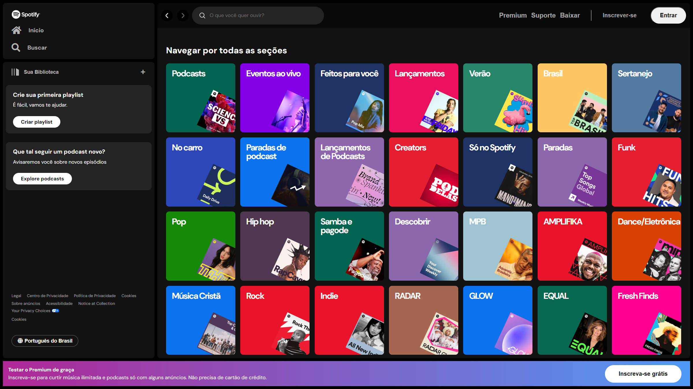

**SPOTIFY CLONE**

##

**ABOUT SPOTIFY CLONE**

- The Spotify clone was an exercise during a Front-End course from Alura that lasted 5 Days;
- The goal was to have an imersion of the Front-End developer daily tasks;
- I went a little far and added details to look very similar of the original "search";

##

**OBERVATIONS**

- The code is not optimized, so there're a lot repetition;
- The "Media Queries" file still need some work too to make the page responsible;
- During the course we had some contact with HTML, CSS, JS & REACT;
- [About Alura](https://www.alura.com.br);
